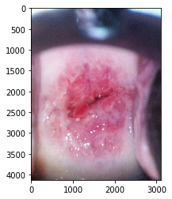
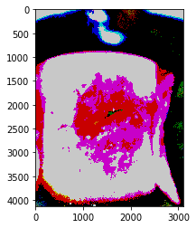
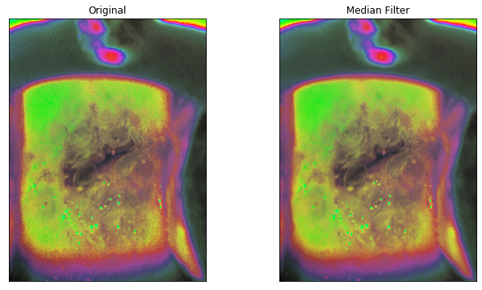
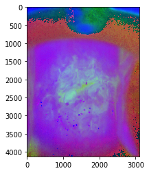
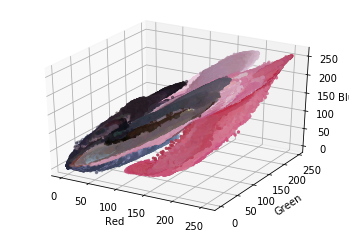
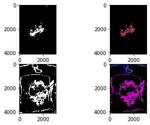
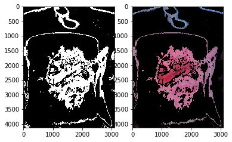
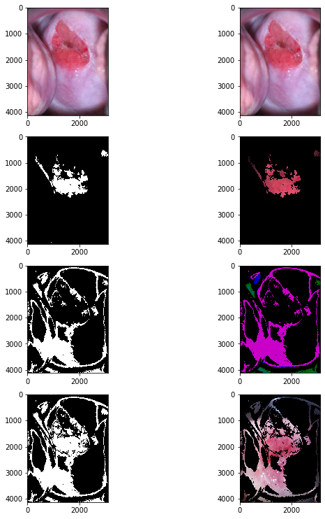

```python
from PIL import Image
import s3fs

fs = s3fs.S3FileSystem()

# To List 5 files in your accessible bucket
fs.ls('s3://sagemaker-studio-741205342696-qywycdas2a/CervicalCancer/Train/Type_1')[:5]

# open it directly
with fs.open(f's3://s3://sagemaker-studio-741205342696-qywycdas2a/CervicalCancer/Train/Type_1/10.jpg') as f:
    IM=Image.open(f)
    width, height = IM.size
```


```python
print(width, height)
```

    3096 4128


```python
from __future__ import print_function

import numpy as np
import tensorflow as tf

from keras.applications.inception_v3 import InceptionV3, preprocess_input
from keras.preprocessing import image
from keras.models import Model
from keras.layers import Dense, GlobalAveragePooling2D
from keras.layers.core import Dropout
from keras import backend as K
from keras.optimizers import SGD

from sklearn.metrics import confusion_matrix, classification_report
import pandas as pd

from six.moves import cPickle as pickle
#from six.moves import range
#from scipy import ndimage
import os

import PIL.Image
#from cStringIO import StringIO
import IPython.display
```

    Using TensorFlow backend.


```python
def load_image_filenames(folders):
    image_files = []
    
    for folder_tuple in folders:
        folder = folder_tuple[0]
        label_index = folder_tuple[1] - 1

        image_filepaths = [os.path.join(folder, image_filename) for image_filename in os.listdir(folder)]
        image_files.extend([(image_filepath, label_index) for image_filepath in image_filepaths])
        
    return image_files

def load_image(filename, target_size):
    try:
        img = image.load_img(filename, target_size=target_size)
    except IOError as e:
        print('Could not read:', filename, ':', e, ', skipping.')
        return None

    x = image.img_to_array(img)
    x = np.expand_dims(x, axis=0)
    x = preprocess_input(x)
    return x
    
def load_images(image_files, target_size):
    x_list = []
    y_list = []
    
    for image_file in image_files:
        image_filepath = image_file[0]
        label_index = image_file[1]

        x = load_image(image_filepath, target_size)
        if x == None:
            continue
            
        x_list.append(x)

        y = np.zeros((1, 3))
        y[0, label_index] = 1
        y_list.append(y)
        
    X = np.vstack(x_list)
    y = np.vstack(y_list)
    
    return X, y
```


```python
def denormalize_input(x):
    """
    Converts image pixels from -1:1 range to 0:255 range.
    """
    x /= 2.
    x += 0.5
    x *= 255.
    return x
```


```python
%pylab inline
import matplotlib.pyplot as plt
import matplotlib.image as mpimg
import numpy as np
img=mpimg.imread('262.jpg')
imgplot = plt.imshow(img)
plt.show()
```

    Populating the interactive namespace from numpy and matplotlib


    /home/ec2-user/anaconda3/envs/tensorflow2_p36/lib/python3.6/site-packages/IPython/core/magics/pylab.py:160: UserWarning: pylab import has clobbered these variables: ['norm', 'f']
    `%matplotlib` prevents importing * from pylab and numpy
      "\n`%matplotlib` prevents importing * from pylab and numpy"





```python
# "binarizing" (sort of) intensity values
new_img = np.zeros_like(img)
#new_img[img < np.percentile(new_img[2],0.25)] = 100 # n = 30 worked!
new_img[img < 30] = 100
new_img[img > 130] = 200 # n = 130 worked 
plt.imshow(new_img)
```


    <matplotlib.image.AxesImage at 0x7fb11a9f4908>





```python

#apply median filter to remove noise 
import numpy as np
import cv2
from matplotlib import pyplot as plt
from PIL import Image, ImageFilter
%matplotlib inline
image = mpimg.imread('262.jpg') # reads the image

image1 = cv2.cvtColor(image, cv2.COLOR_BGR2HSV) # convert to HSV
figure_size = 9 # the dimension of the x and y axis of the kernal.


new_image = cv2.medianBlur(image, figure_size)
plt.figure(figsize=(11,6))
plt.subplot(121), plt.imshow(cv2.cvtColor(image, cv2.COLOR_HSV2RGB)),plt.title('Original')
plt.xticks([]), plt.yticks([])
plt.subplot(122), plt.imshow(cv2.cvtColor(new_image, cv2.COLOR_HSV2RGB)),plt.title('Median Filter')
plt.xticks([]), plt.yticks([])
plt.show()

```





```python
#segment based on color source https://realpython.com/python-opencv-color-spaces/
flags = [i for i in dir(cv2) if i.startswith('COLOR_')]
image2=cv2.cvtColor(image, cv2.COLOR_BGR2HSV)
plt.imshow(image2)
plt.show()
```





```python
#plot the colors 
from mpl_toolkits.mplot3d import Axes3D
from matplotlib import cm
from matplotlib import colors
```


```python

new_image= mpimg.imread('254.jpg')
r, g, b = cv2.split(new_image)
#fig = plt.figure()
#axis = fig.add_subplot(1, 1, 1, projection="3d")
```


```python
pixel_colors = image.reshape((np.shape(new_image)[0]*np.shape(new_image)[1], 3))
norm = colors.Normalize(vmin=-1.,vmax=1.)
norm.autoscale(pixel_colors)
pixel_colors = norm(pixel_colors).tolist()
```


```python
fig = plt.figure()
axis = fig.add_subplot(1, 1, 1, projection="3d")
axis.scatter(r.flatten(), g.flatten(), b.flatten(), facecolors=pixel_colors, marker=".")
axis.set_xlabel("Red")
axis.set_ylabel("Green")
axis.set_zlabel("Blue")
plt.show()
```





```python
#Plot hsv 
hsv_nemo = cv2.cvtColor(image, cv2.COLOR_RGB2HSV)
h, s, v = cv2.split(hsv_nemo)
fig = plt.figure()
axis = fig.add_subplot(1, 1, 1, projection="3d")

axis.scatter(h.flatten(), s.flatten(), v.flatten(), facecolors=pixel_colors, marker=".")
axis.set_xlabel("Hue")
axis.set_ylabel("Saturation")
axis.set_zlabel("Value")
plt.show()

```


```python
light_pink =(50, 153, 20)
dark_pink=(200,255,200)
hsv_nemo = cv2.cvtColor(new_image, cv2.COLOR_RGB2HSV)
hsv_new11= cv2.cvtColor(new_img, cv2.COLOR_RGB2HSV)
```


```python
mask = cv2.inRange(hsv_nemo, light_pink, dark_pink)
mask11 = cv2.inRange(hsv_new11, light_pink, dark_pink)
```


```python
result = cv2.bitwise_and(img, img, mask=mask)
result11 = cv2.bitwise_and(new_img, new_img, mask=mask11)
```


```python
plt.subplot(2, 2, 1)
plt.imshow(mask, cmap="gray")
plt.subplot(2, 2, 2)
plt.imshow(result)
plt.subplot(2, 2, 3)
plt.imshow(mask11, cmap="gray")
plt.subplot(2, 2, 4)
plt.imshow(result11)
plt.show()
```





```python
final_mask = mask + mask11
final_result = cv2.bitwise_and(img, img, mask=final_mask)
plt.subplot(1, 2, 1)
plt.imshow(final_mask, cmap="gray")
plt.subplot(1, 2, 2)
plt.imshow(final_result)
plt.show()
```





```python
%pylab inline
import matplotlib.pyplot as plt
import matplotlib.image as mpimg
import numpy as np
img=mpimg.imread('254.jpg')
imgplot = plt.imshow(img)
plt.show()

# "binarizing" (sort of) intensity values
new_img = np.zeros_like(img)
#new_img[img < np.percentile(new_img[2],0.25)] = 100 # n = 30 worked!
new_img[img < 40] = 100
new_img[img > 100] = 200 # n = 130 worked 
plt.imshow(new_img)


```


```python

```


```python

```


```python
#apply median filter to remove noise 
import numpy as np
import cv2
from matplotlib import pyplot as plt
from PIL import Image, ImageFilter

#plot the colors 
from mpl_toolkits.mplot3d import Axes3D
from matplotlib import cm
from matplotlib import colors

def image_mask(image):
    %matplotlib inline
    image = mpimg.imread(image) # reads the image

    figure_size = 9 # the dimension of the x and y axis of the kernal.
    new_image = cv2.medianBlur(image, figure_size)
    
    new_img = np.zeros_like(image)
    #new_img[img < np.percentile(new_img[2],0.25)] = 100 # n = 30 worked!
    new_img[image < 30] = 100
    new_img[image > 130] = 200 # n = 130 worked 
    
    light_pink =(50, 153, 20)
    dark_pink=(200,255,255)
    
    hsv_nemo = cv2.cvtColor(new_image, cv2.COLOR_RGB2HSV)
    hsv_new11= cv2.cvtColor(new_img, cv2.COLOR_RGB2HSV)
    
    mask = cv2.inRange(hsv_nemo, light_pink, dark_pink)
    mask11 = cv2.inRange(hsv_new11, light_pink, dark_pink)
    
    result = cv2.bitwise_and(new_image, new_image, mask=mask)
    result11 = cv2.bitwise_and(new_img, new_img, mask=mask11)
    
    
    final_mask = mask + mask11
    final_result = cv2.bitwise_and(img, img, mask=final_mask)
    
    return final_result

    plt.figure(figsize=(10,13))
    #plt.subplot(4, 2, 1)
    #plt.imshow(image)
    #plt.subplot(4, 2, 2)
    #plt.imshow(new_image)
    #plt.subplot(4, 2, 3)
    #plt.imshow(mask, cmap="gray")
    #plt.subplot(4, 2, 4)
    #plt.imshow(result)
    #plt.subplot(4, 2, 5)
    #plt.imshow(mask11, cmap="gray")
    #plt.subplot(4, 2, 6)
    #plt.imshow(result11)
    #plt.subplot(4, 2, 7)
    #plt.imshow(final_mask, cmap="gray")
    #plt.subplot(4, 2, 8)
    #plt.imshow(final_result)
    
    #cbar = plt.colorbar()
    #cbar.set_label('Color Intensity')
    
    #plt.show()

```


```python

```


```python
from PIL import Image  
import PIL 
import imageio

image0=image_mask('CervicalCancer/CC_smallDataset/Type_1/201.jpg')

im = Image.fromarray(image0) #converted to an image 

imageio.imwrite('pro_imgs/Type1/myphoto.jpg', image0)


#import scipy.misc
#scipy.misc.imsave('pro_imgs/Type1/myphoto.jpg', im)
#status = cv2.imwrite('pro_imgs/Type1/myphoto.jpg',im)
#im.save('pro_imgs/Type1/myphoto.jpg')
#print("Image written to file-system : ",status)
#print(dtype(image0))


```


    ---------------------------------------------------------------------------

    FileNotFoundError                         Traceback (most recent call last)

    <ipython-input-138-cc672bc7f357> in <module>
          7 im = Image.fromarray(image0) #converted to an image
          8 
    ----> 9 imageio.imwrite('pro_imgs/Type1/myphoto.jpg', image0)
         10 
         11 


    ~/anaconda3/envs/tensorflow2_p36/lib/python3.6/site-packages/imageio/core/functions.py in imwrite(uri, im, format, **kwargs)
        301 
        302     # Get writer and write first
    --> 303     writer = get_writer(uri, format, "i", **kwargs)
        304     with writer:
        305         writer.append_data(im)


    ~/anaconda3/envs/tensorflow2_p36/lib/python3.6/site-packages/imageio/core/functions.py in get_writer(uri, format, mode, **kwargs)
        215 
        216     # Create request object
    --> 217     request = Request(uri, "w" + mode, **kwargs)
        218 
        219     # Get format


    ~/anaconda3/envs/tensorflow2_p36/lib/python3.6/site-packages/imageio/core/request.py in __init__(self, uri, mode, **kwargs)
        119 
        120         # Parse what was given
    --> 121         self._parse_uri(uri)
        122 
        123         # Set extension


    ~/anaconda3/envs/tensorflow2_p36/lib/python3.6/site-packages/imageio/core/request.py in _parse_uri(self, uri)
        260                 dn = os.path.dirname(fn)
        261                 if not os.path.exists(dn):
    --> 262                     raise FileNotFoundError("The directory %r does not exist" % dn)
        263 
        264     @property


    FileNotFoundError: The directory '/home/ec2-user/SageMaker/pro_imgs/Type1' does not exist


```python
import cv2
import os
from glob import glob

folder='CervicalCancer/CC_smallDataset/Type_1'
path='pro_imgs/Type1'

for i, image in enumerate (glob('CervicalCancer/CC_smallDataset/Type_1/*.jpg')):
    image=image_mask(image)
    cv2.imwrite(os.path.join(path , 'image'+str(i)+'.jpg'), image)
    cv2.waitKey(0)
    
```





    ---------------------------------------------------------------------------

    error                                     Traceback (most recent call last)

    <ipython-input-103-d78233a4cfe5> in <module>
          8 for i, image in enumerate (glob('CervicalCancer/CC_smallDataset/Type_1/*.jpg')):
          9     image=image_mask(image)
    ---> 10     cv2.imwrite(os.path.join(path , 'image'+str(i)+'.jpg'), image)
         11     cv2.waitKey(0)
         12 


    error: OpenCV(4.2.0) /io/opencv/modules/imgcodecs/src/loadsave.cpp:715: error: (-215:Assertion failed) !_img.empty() in function 'imwrite'


```python
import os
import numpy as np
import shutil
import random

# # Creating Train / Val / Test folders (One time use)
root_dir = '3_classes'
classes_dir = ['/class1', 'class2', 'class3', 'class4']

val_ratio = 0.15
test_ratio = 0.05

for cls in classes_dir:
    os.makedirs(root_dir +'/train' + cls)
    os.makedirs(root_dir +'/val' + cls)
    os.makedirs(root_dir +'/test' + cls)


    # Creating partitions of the data after shuffeling
    src = root_dir + cls # Folder to copy images from

    allFileNames = os.listdir(src)
    np.random.shuffle(allFileNames)
    train_FileNames, val_FileNames, test_FileNames = np.split(np.array(allFileNames),
                                                              [int(len(allFileNames)* (1 - val_ratio + test_ratio)), 
                                                               int(len(allFileNames)* (1 - test_ratio))])


    train_FileNames = [src+'/'+ name for name in train_FileNames.tolist()]
    val_FileNames = [src+'/' + name for name in val_FileNames.tolist()]
    test_FileNames = [src+'/' + name for name in test_FileNames.tolist()]

    print('Total images: ', len(allFileNames))
    print('Training: ', len(train_FileNames))
    print('Validation: ', len(val_FileNames))
    print('Testing: ', len(test_FileNames))

    # Copy-pasting images
    for name in train_FileNames:
        shutil.copy(name, root_dir +'/train' + cls)

    for name in val_FileNames:
        shutil.copy(name, root_dir +'/val' + cls)
```
